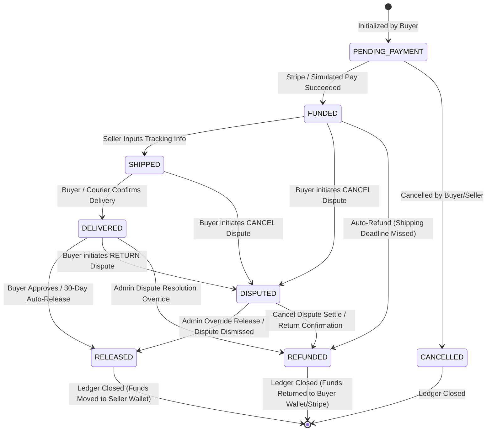

# ♻️ TradeSmart: ML-Powered Second-Hand & Scrap Trading Platform

TradeSmart is an intelligent full-stack web application designed to modernize the second-hand goods and scrap trading ecosystem. By leveraging **Machine Learning** (price prediction, visual search, and logo authenticity detection) and a **production-hardened Escrow system**, TradeSmart guarantees fair pricing, counterfeit prevention, and secure transaction workflows.

---

## 🏗️ System Architecture

TradeSmart follows a classic decoupled client-server architecture with a real-time data tier:

```mermaid
graph TD
    %% Client Tier
    subgraph Client Tier (React + Vite + Tailwind)
        A[React UI Pages] --> B[Axios API Clients]
        A --> C[Firebase Web Auth SDK]
        D[Service Worker / PWA Cache] -.-> A
    end

    %% Backend Tier
    subgraph Backend Tier (Flask REST API)
        E[Flask CORS Wrapper] --> F[Blueprint Routers]
        F --> G[JWT auth_required Middleware]
        
        %% Core Engines
        G --> H[Escrow FSM Engine]
        G --> I[Wallet & Cashout Ledger]
        G --> J[Dispute Manager]
        G --> K[Messaging & Notification Services]
        
        %% ML Services Layer
        F --> L[ML Inference Pipelines]
        L --> M[MobileNetV2 Feature Extractor]
        L --> N[Random Forest Price Regressor]
        L --> O[Isolation Forest Authenticity Classifier]
    end

    %% Storage & Database Tier
    subgraph Storage & Database Tier (Firebase Cloud)
        P[(Firebase Realtime Database)]
        Q[(Firebase Storage)]
        R[(Firebase Auth Users)]
        
        H <--> |Atomic Transactions| P
        I <--> P
        J <--> P
        K <--> P
        C <--> R
        M --> |Download Images| Q
    end

    B --> |HTTP REST & Bearer Tokens| E
```

---

## 💡 System Workflows & Lifecycle

### 1. Listing and Verifying Flow (Selling)
1. **Details Input**: The seller inputs product details (category, brand, original price, age in years, condition, usage hours, location, warranty status, box availability).
2. **AI Price Recommendation**: The seller can query the **Smart Price Estimator** to obtain a recommended resale price range based on historical depreciation.
3. **Anti-Counterfeit Upload**: The seller uploads a close-up image of the product's brand logo to the **Authenticity Lab**. MobileNetV2 extracts visual features, and a classifier evaluates if it is original or counterfeit.
4. **Publishing**: The product data, along with its logo verification status (`Verified` or `Suspicious`), is written to `/products/{product_id}` in the Firebase Realtime Database (RTDB).

### 2. The Escrow FSM Lifecycle (Transaction & Payment)
All transactions are governed by a strict Finite State Machine (FSM) defined in `escrow_routes.py`. Transitions are atomic, ensuring funds cannot be double-spent, locked indefinitely, or released prematurely.



### 3. Dispute and Refund Handling
Buyers can report transactions based on two options:
* **CANCEL (Pre-delivery)**: Available when status is `FUNDED` or `SHIPPED`. The escrow is set to `DISPUTED` and locked. A refund is scheduled to be automatically processed in exactly **3 days** unless resolved by an Admin.
* **RETURN (Post-delivery)**: Available only after the status is `DELIVERED`. The escrow locks in `DISPUTED`. The refund is held until the seller confirms they have retrieved the product via `/confirm-return`, which resets the auto-refund schedule to **3 days** from confirmation.

### 4. Seller Earnings and Cashout Flow
1. **Wallet Ledger**: When an escrow transitions to `RELEASED`, the contract amount is atomically transferred to `/wallets/{seller_id}/balance`.
2. **OTP Verification**: To request cashout, the seller submits a mobile verification request. A simulated 6-digit OTP is sent to the registered mobile number.
3. **Cashout Request**: Upon successful OTP verification, the seller inputs bank or UPI transfer details. The server verifies that the account holder's name matches the profile name.
4. **Deduction and Scheduling**: The requested cashout amount is deducted from the wallet balance, and a request is created in `/payout_requests/{payout_id}` with status `SCHEDULED` (expected settlement in **3 days**).
5. **Auto-Settlement**: The background scheduler eventually fires `/scheduler/settle-cashouts`, updating the status to `SENT` and notifying the seller.

---

## 📊 Database Schema (Firebase RTDB JSON Layout)

Below is the structure of the primary database nodes used for synchronization:

```json
{
  "users": {
    "{uid}": {
      "username": "johndoe",
      "email": "johndoe@example.com",
      "password": "$2b$12$hashedpassword...",
      "full_name": "John Doe",
      "phone": "9876543210",
      "profilePic": "https://ui-avatars.com/api/?name=johndoe",
      "bio": "Bio content...",
      "createdAt": "2026-07-05T12:00:00Z"
    }
  },
  "products": {
    "{product_id}": {
      "title": "iPhone 13 Pro",
      "category": "Electronics",
      "brand": "Apple",
      "price": 45000,
      "original_price": 120000,
      "age_years": 2,
      "condition": "Excellent",
      "usage_hours": 1500,
      "location": "New Delhi",
      "image_url": "https://storage.googleapis.com/...iphone.jpg",
      "logo_status": "Verified",
      "logo_confidence": 0.9852,
      "user_id": "{seller_uid}"
    }
  },
  "escrows": {
    "{escrow_id}": {
      "product_id": "{product_id}",
      "buyer_id": "{buyer_uid}",
      "seller_id": "{seller_uid}",
      "created_at": 1783262400,
      "status_matrix": {
        "escrow_status": "FUNDED",
        "payment_status": "PAID",
        "shipment_status": "PENDING"
      },
      "ledger": {
        "amount": 45000.0,
        "is_locked": false,
        "is_closed": false,
        "tracking_number": "TRK123456",
        "shipping_carrier": "Bluedart"
      },
      "deadlines": {
        "created_at": 1783262400,
        "ship_by": 1783521600,
        "auto_release_at": 0,
        "refund_expected_by": 0
      },
      "dispute": {
        "kind": "RETURN",
        "reason": "Damaged screen on arrival",
        "opened_by": "{buyer_uid}",
        "opened_at": 1783300000,
        "return_required": true,
        "return_confirmed": false
      },
      "audit_trail": {
        "log_1783262400": {
          "old_state": "PENDING_PAYMENT",
          "new_state": "FUNDED",
          "action_by": "CLIENT_CONFIRM",
          "role": "SYSTEM",
          "reason": "Stripe payment confirmed",
          "timestamp": 1783262400
        }
      }
    }
  },
  "disputes": {
    "{dispute_id}": {
      "dispute_id": "{dispute_id}",
      "escrow_id": "{escrow_id}",
      "product_id": "{product_id}",
      "buyer_id": "{buyer_uid}",
      "seller_id": "{seller_uid}",
      "kind": "RETURN",
      "reason": "Description text...",
      "status": "AWAITING_RETURN_CONFIRMATION",
      "created_at": 1783300000,
      "refund_expected_by": 0,
      "product_title": "iPhone 13 Pro",
      "product_image_url": "https://..."
    }
  },
  "wallets": {
    "{user_id}": {
      "balance": 45000.0,
      "currency": "INR",
      "last_updated_at": "2026-07-05T13:00:00Z"
    }
  },
  "wallet_transactions": {
    "{transaction_id}": {
      "user_id": "{user_id}",
      "amount": 45000.0,
      "type": "ESCROW_RELEASE",
      "status": "COMPLETED",
      "timestamp": "2026-07-05T13:00:00Z"
    }
  },
  "payout_requests": {
    "{payout_id}": {
      "payout_id": "{payout_id}",
      "user_id": "{user_id}",
      "amount": 10000.0,
      "method": "BANK",
      "provider": "STRIPE_SIMULATED",
      "transfer_status": "SCHEDULED",
      "settlement_expected_by": 1783521600,
      "bank_account_number_masked": "****5678",
      "ifsc_code": "HDFC0000123",
      "account_holder_name": "John Doe",
      "created_at": 1783262400
    }
  }
}
```

---

## 📂 Project Directory & File Responsibilities

### 1. Client App (React, Tailwind, Vite)
* [client/index.html](file:///c:/Users/Akshit/Desktop/ml%20scraptrade/code/client/index.html): Core HTML structure containing SEO headers, mobile manifest linkage, and local service worker bootstrapper.
* [client/package.json](file:///c:/Users/Akshit/Desktop/ml%20scraptrade/code/client/package.json): Defines Javascript dependencies, including React 18, React Router DOM 6, Axios, Firebase, Stripe, and Vite bundler scripts.
* [client/vite.config.js](file:///c:/Users/Akshit/Desktop/ml%20scraptrade/code/client/vite.config.js): Custom Vite build configuration, mapping the local development server ports (defaulting to 5173).
* [client/tailwind.config.js](file:///c:/Users/Akshit/Desktop/ml%20scraptrade/code/client/tailwind.config.js): Custom design-system configuration containing colors (`brand-500` emerald primary, `accent-500` blue), fonts (Clash Display, Inter), custom shadows, mesh gradients, and floating animations.
* [client/postcss.config.js](file:///c:/Users/Akshit/Desktop/ml%20scraptrade/code/client/postcss.config.js): Integrates Tailwind and Autoprefixer during Vite compiles.
* [client/public/manifest.json](file:///c:/Users/Akshit/Desktop/ml%20scraptrade/code/client/public/manifest.json): Configuration file specifying theme metadata, orientation, icons, and start URLs for PWA capability.
* [client/public/sw.js](file:///c:/Users/Akshit/Desktop/ml%20scraptrade/code/client/public/sw.js): Progressive Web App (PWA) Service Worker. Pre-caches core assets, implements clean navigation fallbacks, intercepts background API calls, and serves cached responses if offline.
* [client/src/main.jsx](file:///c:/Users/Akshit/Desktop/ml%20scraptrade/code/client/src/main.jsx): React runtime entry-point mapping the App into `div#root`.
* [client/src/App.jsx](file:///c:/Users/Akshit/Desktop/ml%20scraptrade/code/client/src/App.jsx): Main router layout. Holds the custom Context Providers (Theme and Auth), registers public landing screens (Home, Browse), and encapsulates secure profiles under `<ProtectedRoute>`.

### 2. Server App (Flask REST API)
* [server/app.py](file:///c:/Users/Akshit/Desktop/ml%20scraptrade/code/server/app.py): Application factory wrapper. Handles cross-origin requests (CORS), configures Firebase SDK credentials, registers route Blueprints, exposes a health check endpoint, and spins up a background thread (`preload_models`) to load AI weights asynchronously without stalling incoming connections.
* [server/check_escrows.py](file:///c:/Users/Akshit/Desktop/ml%20scraptrade/code/server/check_escrows.py): Utility script that simulates cron maintenance execution. Invokes `run_maintenance()` on escrows to check deadlines and process auto-refunds or releases.
* [server/requirements.txt](file:///c:/Users/Akshit/Desktop/ml%20scraptrade/code/server/requirements.txt): Specific backend package requirements.
* [server/test_auth.py](file:///c:/Users/Akshit/Desktop/ml%20scraptrade/code/server/test_auth.py), [server/test_earnings.py](file:///c:/Users/Akshit/Desktop/ml%20scraptrade/code/server/test_earnings.py), [server/test_fb.py](file:///c:/Users/Akshit/Desktop/ml%20scraptrade/code/server/test_fb.py): Local verification scripts validating authorization middleware, mock calculations, and connection status to Firebase RTDB.

### 3. API Blueprints (`server/routes/`)
* [server/routes/auth_routes.py](file:///c:/Users/Akshit/Desktop/ml%20scraptrade/code/server/routes/auth_routes.py): Manages profile registration, hashing via `bcrypt`, login verification, JWT token generation, and profile details retrieval/updates.
* [server/routes/product_routes.py](file:///c:/Users/Akshit/Desktop/ml%20scraptrade/code/server/routes/product_routes.py): Implements CRUD APIs for managing product listings in the database.
* [server/routes/escrow_routes.py](file:///c:/Users/Akshit/Desktop/ml%20scraptrade/code/server/routes/escrow_routes.py): The FSM core engine. Coordinates states (`PENDING_PAYMENT`, `FUNDED`, `SHIPPED`, `DELIVERED`, `DISPUTED`, `RELEASED`, `REFUNDED`, `CANCELLED`), handles audit logs, and validates actions using role-based permissions (Buyer, Seller, Admin, System). Includes scheduler endpoints for auto-releases and auto-refunds.
* [server/routes/dispute_routes.py](file:///c:/Users/Akshit/Desktop/ml%20scraptrade/code/server/routes/dispute_routes.py): Processes buyer dispute requests (CANCEL/RETURN), writes dispute logs, coordinates seller return confirmations, and triggers notifications.
* [server/routes/payment_routes.py](file:///c:/Users/Akshit/Desktop/ml%20scraptrade/code/server/routes/payment_routes.py): Integrates Stripe PaymentIntents, captures Stripe Webhooks for verification, updates escrow states to `FUNDED`, and includes dev-simulation loops to skip Stripe validation.
* [server/routes/wallet_routes.py](file:///c:/Users/Akshit/Desktop/ml%20scraptrade/code/server/routes/wallet_routes.py): Calculates ledger balances, handles OTP request generation, OTP code checks, cashout scheduling (UPI/Bank validation), and processes cashout settlements.
* [server/routes/ai_routes.py](file:///c:/Users/Akshit/Desktop/ml%20scraptrade/code/server/routes/ai_routes.py): Connects the price recommendation frontend to the backend RF regressor model.
* [server/routes/image_routes.py](file:///c:/Users/Akshit/Desktop/ml%20scraptrade/code/server/routes/image_routes.py): API endpoint route processing visual similarity query requests.
* [server/routes/logo_routes.py](file:///c:/Users/Akshit/Desktop/ml%20scraptrade/code/server/routes/logo_routes.py): Exposes uploading APIs for the Logo Authenticators and serves reference brand logos.
* [server/routes/messaging_routes.py](file:///c:/Users/Akshit/Desktop/ml%20scraptrade/code/server/routes/messaging_routes.py): Manages user-to-user chat thread initializations and direct message logs.
* [server/routes/notifications_routes.py](file:///c:/Users/Akshit/Desktop/ml%20scraptrade/code/server/routes/notifications_routes.py): Facilitates retrieval and mark-as-read updates for real-time notifications.
* [server/routes/shipment_routes.py](file:///c:/Users/Akshit/Desktop/ml%20scraptrade/code/server/routes/shipment_routes.py): API to query tracking updates and logistical data.
* [server/routes/category_routes.py](file:///c:/Users/Akshit/Desktop/ml%20scraptrade/code/server/routes/category_routes.py): Manages product category schema lists.
* [server/routes/user_ratings_routes.py](file:///c:/Users/Akshit/Desktop/ml%20scraptrade/code/server/routes/user_ratings_routes.py): Computes peer ratings and user trust scores.
* [server/routes/watchlist_routes.py](file:///c:/Users/Akshit/Desktop/ml%20scraptrade/code/server/routes/watchlist_routes.py): Adds and removes items from a user's watchlist.
* [server/routes/feedback_routes.py](file:///c:/Users/Akshit/Desktop/ml%20scraptrade/code/server/routes/feedback_routes.py): API to submit application and user feedback.

### 4. Machine Learning & Utilities
* [server/ml_services/price_predictor/predictor.py](file:///c:/Users/Akshit/Desktop/ml%20scraptrade/code/server/ml_services/price_predictor/predictor.py): Fair Price Estimator. Predicts resale value by preprocessing 9 structural inputs (e.g. depreciation scaling, warranty weight) using a trained `Random Forest Regressor` model stored in `ml_models/price_model.joblib`.
* [server/ml_services/logo_verifier/classifier.py](file:///c:/Users/Akshit/Desktop/ml%20scraptrade/code/server/ml_services/logo_verifier/classifier.py): Authenticity Lab (LogoGuard AI). Uses MobileNetV2 pre-trained on ImageNet to extract a 1280-dimension vector representing the uploaded logo. A trained binary classification model determines if the logo matches known original signatures (threshold set to 85% probability).
* [server/ml_services/image_search/search_engine.py](file:///c:/Users/Akshit/Desktop/ml%20scraptrade/code/server/ml_services/image_search/search_engine.py): Visual Search Engine. Builds a live index of all marketplace listings. It processes item images using MobileNetV2, normalizes the feature vectors (L2-norm), caches results for 30 minutes, and performs visual search query lookups via cosine similarity (threshold set to 40% similarity match).
* [server/utils/firebase_db.py](file:///c:/Users/Akshit/Desktop/ml%20scraptrade/code/server/utils/firebase_db.py): Implements structured API abstractions (ProductsAPI, EscrowAPI, WalletAPI, DisputesAPI) over the raw Firebase Admin DB, performing atomic transactions and queries.
* [server/utils/auth_helper.py](file:///c:/Users/Akshit/Desktop/ml%20scraptrade/code/server/utils/auth_helper.py): Custom authorization decorator (`token_required`) that intercepts and parses HS256-signed JWTs from requests.
* [server/utils/ai_helper.py](file:///c:/Users/Akshit/Desktop/ml%20scraptrade/code/server/utils/ai_helper.py): Helper functions to download, resize, and convert input images into tensors suitable for MobileNetV2 inference.

### 5. Automation & Data Training Scripts
* [scripts/model_training/train_price_model.py](file:///c:/Users/Akshit/Desktop/ml%20scraptrade/code/scripts/model_training/train_price_model.py): Pipelines and trains the Random Forest Regressor on categories, conditions, and prices.
* [scripts/model_training/train_logo_classifier.py](file:///c:/Users/Akshit/Desktop/ml%20scraptrade/code/scripts/model_training/train_logo_classifier.py): Script training the authenticity evaluation model.
* [scripts/backfill_logo_metadata.py](file:///c:/Users/Akshit/Desktop/ml%20scraptrade/code/scripts/backfill_logo_metadata.py): Populates metadata in RTDB for training files.
* [scripts/fix_image_urls.py](file:///c:/Users/Akshit/Desktop/ml%20scraptrade/code/scripts/fix_image_urls.py): Database normalization script adjusting raw image assets to standard URLs.
* [scripts/fix_productdetails_jsx.py](file:///c:/Users/Akshit/Desktop/ml%20scraptrade/code/scripts/fix_productdetails_jsx.py): Automated script parsing and fixing component layout parameters in the React source files.

---

## 🛠️ Technology Stack & Libraries

### 💻 Frontend (Client)
* **Framework**: React 18 (Vite Bundler)
* **Styling**: Tailwind CSS 3 (Dynamic Space Theme & Glassmorphism UI)
* **Routing**: React Router DOM 6
* **HTTP Requests**: Axios
* **Payment Integration**: Stripe React SDK
* **Real-time Client Sync**: Firebase Web SDK (Authentication)

### ⚙️ Backend (Server)
* **API Framework**: Flask 3 (Blueprint Modular Routing)
* **Authentication & Cryptography**: PyJWT (HS256 signature tokens), bcrypt (blowfish password hashes)
* **Real-time Sync**: Firebase Admin Python SDK
* **Cross-Origin Configuration**: Flask-CORS

### 🧠 Machine Learning & Deep Learning
* **Deep Learning Framework**: TensorFlow 2.20 & Keras 3 (MobileNetV2 architecture used for visual feature extraction)
* **Classical Machine Learning**: Scikit-Learn 1.7 (Random Forest model, metrics, and vector calculations)
* **Data Pipelines**: Pandas 2.3, NumPy 2.2, SciPy 1.16
* **Model Serialization**: joblib 1.5, pickle

---

## ⚙️ Installation & Configuration

### 1. Repository Setup
```bash
git clone https://github.com/Akshitgarg1/ML-Powered-Scrap-Trading-Platform.git
cd ML-Powered-Scrap-Trading-Platform
```

### 2. Environment Variables (`.env`)
Create a `.env` file in the `server` directory:
```env
# Flask Setup
SECRET_KEY=your_jwt_signing_key_here
PORT=5050
FLASK_DEBUG=1
FLASK_USE_RELOADER=0

# Firebase Setup
DATABASE_URL=https://your-firebase-project-default-rtdb.firebaseio.com/
FIREBASE_STORAGE_BUCKET=your-project.appspot.com
FIREBASE_CREDENTIALS_PATH=serviceAccountKey.json

# Payment Integration
STRIPE_SECRET_KEY=sk_test_...
STRIPE_WEBHOOK_SECRET=whsec_...
```

*Note: For the FSM escrow, you must place your generated Firebase admin credential JSON file inside `server/serviceAccountKey.json`.*

### 3. Backend (Server) Startup
```bash
cd server
python -m venv venv
# On Windows
venv\Scripts\activate
# On MacOS/Linux
source venv/bin/activate

pip install -r requirement.txt
python app.py
```

### 4. Frontend (Client) Startup
```bash
cd client
npm install
npm run dev
```
Open `http://localhost:5173` to access the application.

---

## 🛡️ Security & Performance Optimization

* **Background Model Pre-loading**: MobileNetV2 and Random Forest weights are heavy and can block startup. At Flask server boot, models are loaded asynchronously in a background daemon thread (`preload_models()`). This ensures the API immediately responds to health checks and endpoints while the models load.
* **Feature Index Cache**: Building the marketplace visual search index requires processing multiple product images. The search engine caches the extracted feature index for **30 minutes** with an access thread lock, avoiding expensive feature extraction on every visual search query.
* **Atomic Firebase Transactions**: State updates in `escrow_routes.py` are executed inside Firebase RTDB transactions to prevent race conditions during updates.
* **Strict API Access Control**: Security-sensitive endpoints (orders, disputes, cashout requests) require a valid JWT passed in the Authorization header. They verify that the authenticated UID matches the `buyer_id`, `seller_id`, or `admin` roles, preventing cross-user manipulation.
